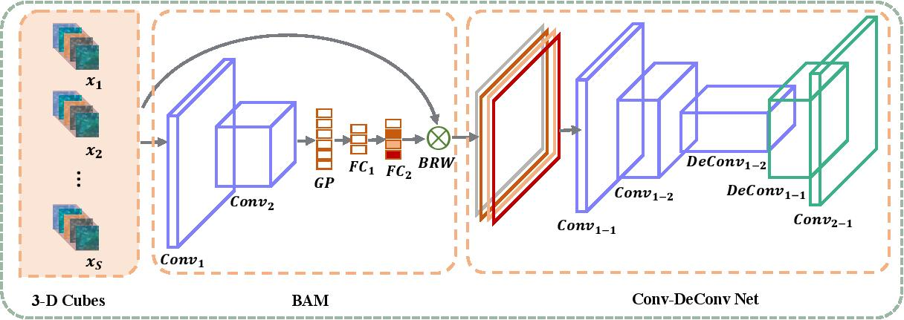
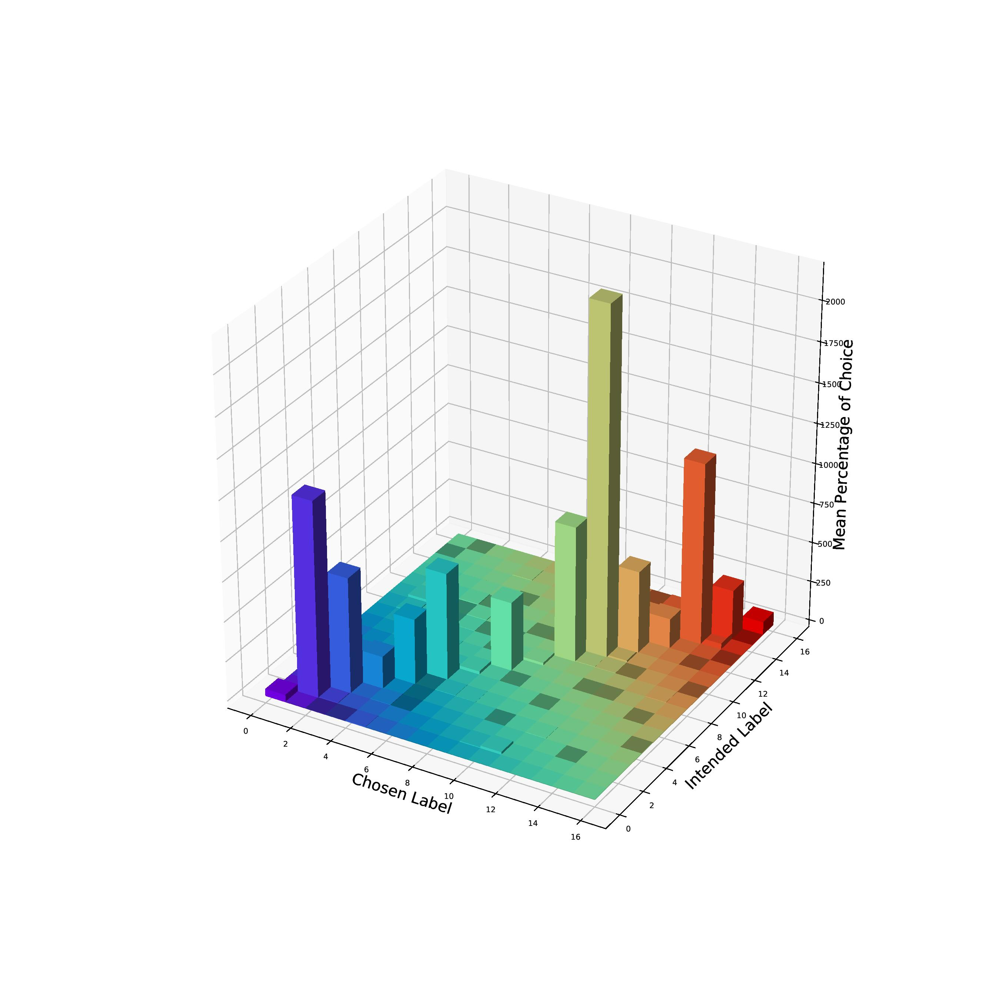
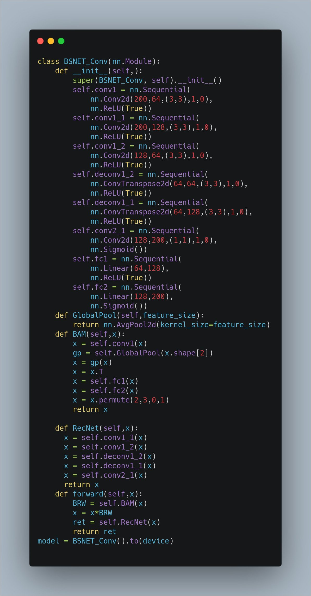

 

# BS-Nets-Implementation-Pytorch 

# Setup
- `conda activate bsnets`
- `pip install -r requirements.txt`

# SSRN Classification
`cd SSRN/`
`python indian.py`

# Plots

# Confusion Matrix

# Architecture Code

